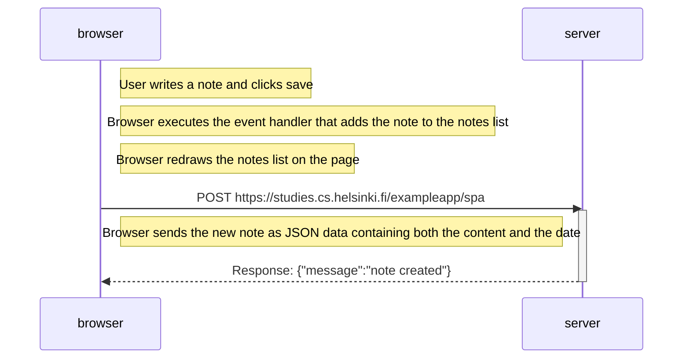

```mermaid
sequenceDiagram
    participant browser
    participant server

    Note right of browser: User writes a note and clicks save
    Note right of browser: Browser executes the event handler that adds the note to the notes list
    Note right of browser: Browser redraws the notes list on the page

    browser->>server: POST https://studies.cs.helsinki.fi/exampleapp/spa
    activate server
    Note right of browser: Browser sends the new note as JSON data containing both the content and the date
    server-->>browser: Response: {"message":"note created"}
    deactivate server
```
